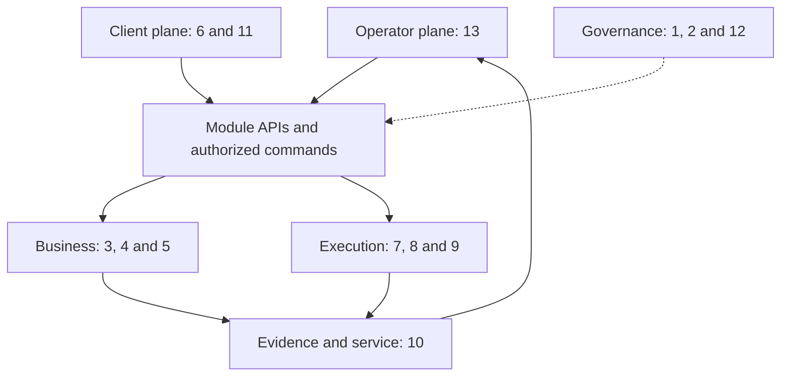

# Nexus V2 architecture map

Draft logical boundaries, not deployed services. Prefer one deployable application with explicit module interfaces until owner research justifies additional services; this is a proposal, not a selected runtime. Buy or integrate commodity capabilities behind the boundaries.

- Workstream 6 establishes tenant/user/project context; 13 maps Nicolas's operator session into that context without granting implicit cross-tenant access.
- Business modules retain authority over their own state; integrations and AI providers are replaceable adapters. Work packets govern bounded changes.
- Workstream 10 consumes auditable facts and owns service/billing/audit storage policy. Read models report evidence freshness and unavailable sources explicitly.
- Governance maintains contracts and evidence. It does not bypass module authorization or become a shared writable database.
- API/event payloads, transports, vendor selection and deployment topology await owner contracts. Lines show logical relationships, not verified integrations.
