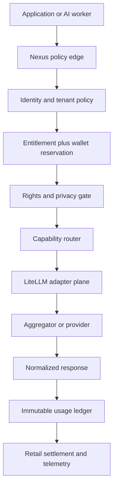

# Nexus V2 — AI Gateway, Bullpen & Economics

Status: **Designed / Needs Review**  
Worker: 8  
Branch: `nexus-v2-p1-08-ai-gateway`  
Canonical read: `nexus-v2/NEXUS-V2-CANONICAL.json` at `77fa238b507c6c38e5ce6f5d5a6cf453432e86fc`  
AI Stack artifacts read: `AI-STACK-CANONICAL.json` and `AI Stack Economics` (2026-09-19)  

This package defines the Phase One contracts. It does not claim a deployed gateway, verified provider route, completed legal review, or benchmarked replacement for Nicolas's current subscriptions.

## A. Architecture



The policy edge is the only application-facing entry point. It creates a request ID and idempotency key, validates identity, resolves tenant policy, reserves worst-case funds, checks commercial rights and privacy, selects a declared route, and passes only an opaque upstream subject. The adapter plane normalizes protocols; it does not decide entitlement, resale eligibility, retail price, or tenant policy. Settlement happens once against the reservation after the terminal attempt.

Required stores:

- PostgreSQL: manifests, rights records, route policy, entitlements, reservations, immutable usage/cost events and audit records.
- Secret manager: internal, project and customer BYOK credentials; only opaque secret references appear in the database.
- Queue/workflow engine: media, batch and long-running agent jobs with leases, cancellation and spend checkpoints.
- Telemetry pipeline: metrics/traces with prompt bodies excluded by default.

## B. Provider adapter contract

```ts
interface ProviderAdapter {
  descriptor(): AdapterDescriptor;
  discoverModels(ctx: AdminContext): Promise<ModelObservation[]>;
  quote(req: NormalizedRequest): Promise<CostEstimate>;
  execute(req: NormalizedRequest, credential: SecretRef): AsyncIterable<NormalizedChunk>;
  cancel(providerRequestId: string): Promise<void>;
  health(): Promise<HealthObservation>;
  reconcile(providerRequestId: string): Promise<ProviderUsage | null>;
}

type AdapterOperation =
  | "chat" | "responses" | "embeddings" | "images" | "video"
  | "audio" | "transcription" | "speech" | "moderation" | "search"
  | "tools" | "batch" | "model_discovery" | "health" | "pricing_metadata";
```

Adapters declare supported operations, streaming, cancellation, idempotency, usage reporting, regions and credential modes. Unsupported operations fail closed. Provider errors map to a stable Nexus taxonomy while retaining a restricted raw diagnostic.

## C–F. Registries and bullpens

The machine-readable schemas are in `schemas/`. One route is one `aggregator + upstream provider + plan + model + use case` tuple.

- Development Bullpen: task fit, benchmark evidence, context/modalities, tool support, effective cost, subscription displacement candidate and reviewer.
- Revenue Bullpen: exact commercial route, intended customer use, rights record, privacy class and approval expiry. Default `UNVERIFIED`.
- Capability Bullpen: ranked routes per function and service level; ranking is evidence-based and environment-specific.
- Model Manifest: aliases and fallback groups live in data, never application conditionals.

## G. Commercial Rights Gate

Evaluation order is fail-closed:

1. Resolve exact provider, plan, model and intended use.
2. Require a non-expired rights record.
3. Require `customer_facing_app_permitted=true` and an allowed monetization pattern.
4. Reject raw API resale unless expressly permitted.
5. Enforce model-specific terms, attribution, end-user terms, industry and geography restrictions.
6. Enforce retention/training/privacy requirements.
7. Record the rights-record version in the request decision and usage event.

Statuses: `APPROVED_MONETIZABLE`, `CONDITIONAL`, `INTERNAL_ONLY`, `REJECTED`, `UNVERIFIED`. `CONDITIONAL` requires a machine-readable condition match or human approval. A company-level approval cannot authorize an unreviewed model/use case. Prior AI Stack statuses remain source evidence; this work adds no new legal approvals.

## H–J. Routing, ladder and fallback

Hard filters run before scoring: capability, operation, rights, tenant, privacy, region, context, modality, tools, credential availability, health, rate limit, reservation and request cap. Eligible routes are scored by configured weights for benchmark quality, latency, reliability, effective successful-task cost and replaceability.

Default ladder:

1. deterministic/no-model path when possible;
2. cheap classifier/router;
3. low-cost qualified model;
4. general model;
5. frontier/specialist model;
6. human approval above the tenant's expensive-job threshold.

Escalation may occur on explicit low confidence, validation failure, evaluator failure, material tool failure or policy-approved retry. Never escalate just because a response is stylistically imperfect. Each stage has attempt and cumulative-cost limits.

Fallback priority:

1. same model, different approved provider;
2. equivalent benchmarked model in the same contract class;
3. explicitly allowed lower-cost/degraded route;
4. queue/pause and disclose degradation.

No fallback may weaken rights, privacy, region, BYOK or tool policy. Material model changes require prior product policy or user approval and are surfaced in response metadata. Context overflow uses summarization/chunking only when the product permits it; otherwise it fails clearly.

## K. BYOK specification

Credential precedence is request-scoped customer BYOK, project BYOK, approved organization BYOK, then approved Nexus internal credential for internal work only. Customer/collaborator BYOK failure returns a BYOK error or an explicitly authorized same-owner fallback. It **never** falls back to Nicolas's personal or Nexus master account.

- Envelope-encrypt secrets under tenant-scoped keys; keep them out of logs, traces and events.
- Resolve credentials after routing and immediately before the upstream call.
- Bind secret references to tenant, project, environment, provider and allowed models.
- Audit create/rotate/use/revoke by reference, never value.
- Cloudflare's `Require provider credentials` (if used) must be enabled to prevent unified-billing fallback on BYOK paths.

## L. Entitlement and wallet interface

```ts
authorize(request): Decision
reserve(requestId, idempotencyKey, maximumWholesale, maximumRetailCredits): Reservation
extend(reservationId, delta, approvalToken?): Reservation
settle(reservationId, terminalUsageEventId): Settlement
release(reservationId, reason): void
```

`authorize` returns capability access, allowance balance, hard caps, route constraints and approval requirements. Reservation is atomic and expires. `settle` is idempotent and accepts exactly one terminal event; retries are costed as attempts but billed according to product policy. Worker 10 owns billing/ledger implementation; Worker 8 owns this contract.

## M–N. Usage, cost and margin events

Canonical schemas: `schemas/ai-usage-event.schema.json` and `schemas/cost-margin-event.schema.json`.

Rules:

- Store reported provider usage and calculated usage separately.
- Preserve currency, price-book version and pricing source version.
- Use integer micros for money and integer quantities with explicit units.
- Gross margin = `(retail revenue - total wholesale cost) / retail revenue`; null when retail revenue is zero.
- Attempt events roll up to one terminal request event; idempotency prevents duplicate retail charges.
- Reconciliation can append adjustments but never mutate historical events.

## O–P. Retail pricing and margin guardrails

Pricing interface accepts subscription, included allowance, usage, credits/re-ups, per-job, per-image, per-video-second, per-audio-minute, per-document, premium surcharge and minimum commitment. It returns a price-book/version, customer-facing units, reservation amount, tax treatment hook and disclosure text. Upstream token economics are internal unless a product deliberately exposes them.

Guardrails are configurable by organization/project/product:

- Target gross margin: 70%; default alert below 75% projected, approval below 70%, deny or contract-approved downgrade below the configured floor.
- Per-request, daily and monthly wholesale caps; customer/project/provider/model caps.
- Worst-case reservation before execution and incremental checkpoints for long jobs.
- Absolute gross-profit floor for expensive media jobs, not percentage alone.
- Price staleness blocks auto-routing when a material cost field is expired or unknown.

Thresholds are policy defaults for review, not approved customer pricing.

## Q. AI worker selection

Workers request a capability profile, not a brand: role (`architecture`, `coding`, `research`, `ui_design`, `qa`, `security`, `review`), complexity, context, modalities, tools, privacy, latency and budget. The registry ranks benchmarked candidates. Current preferences may seed routing weights but do not become permanent rules. Every assignment records model/route, selection rationale, limitations, expected output, reviewer and actual outcome.

Development subscription replacement is `UNVERIFIED` until original ChatGPT, Claude and Grok exports/billing are analyzed and representative jobs are benchmarked for quality, completion rate, latency and effective successful-task cost.

## R. MCP and tool permission model

MCP access is deny-by-default and separately authorized after model selection. Grants bind tenant, project, environment, AI worker, server, specific tools, resource scopes, read/write class, spend limit and expiry. High-risk tools require step-up approval. Tool output is untrusted input and cannot change policy. OAuth tokens must be audience-bound; token passthrough is forbidden. Server manifests and health are versioned; calls receive request/tool-call IDs and audit events.

## S. Threat model

| Threat | Primary controls |
|---|---|
| Master/customer key exposure | secret manager, envelope encryption, no client delivery, rotation, egress restrictions |
| Cross-tenant leakage | tenant-scoped queries/RLS, opaque upstream IDs, isolation tests |
| Prompt/tool injection | untrusted-content labels, policy outside prompt, scoped tools, confirmation for side effects |
| Malicious MCP/tool | registry review, signed/versioned config, network allowlist, sandbox, least privilege |
| Excessive spend/runaway agent | reservations, iteration/time/tool caps, heartbeats, kill switch, approval checkpoints |
| Data exfiltration/provider compromise | egress policy, DLP/redaction, route privacy classes, regional controls |
| Sensitive traces | body-off default, field redaction, short retention, restricted break-glass access |
| Untrusted model output | schema validation, escaping, no direct command execution, human review by risk |
| Billing manipulation/forged events | server-signed events, provider reconciliation, immutable ledger, idempotency |

## T. Privacy and data governance

Every route records retention, training use, enterprise/zero-retention availability, region/data residency, subprocessors, sensitive-data restrictions, deletion path, verification source/date and confidence. Privacy requirements are hard router filters. Prompts/responses are not retained by Nexus telemetry by default; products needing content storage declare purpose, consent, encryption, retention and deletion policy.

## U–V. Observability and operator control

Worker 10/13 receive request/job volume, latency percentiles, errors, retries/fallbacks, usage units, wholesale spend, retail revenue, gross profit/margin, wallet/cap state, provider health/rate limits, anomalies, active expensive jobs and active AI workers. Dimensions include organization, project, app, environment, capability, route and model; user/session identifiers are access-controlled and pseudonymous where possible.

Safe commands are versioned policy changes: disable provider/model, pause customer AI, alter limits, change preferred route, approve/deny expensive job, force an eligible fallback, cancel a job and change BYOK policy when authorized. Each requires RBAC, reason, optimistic version, audit record and optional dual approval. Commands cannot bypass rights, tenant isolation or credential ownership.

## W. Reuse recommendation

Use rather than build:

1. **LiteLLM proxy** for OpenAI-compatible normalization, provider adapters, virtual keys, declared model access, budgets/rate limits, routing/fallback primitives and spend observations. Pin a reviewed version and keep its admin surface private.
2. **Cloudflare AI Gateway** where useful for edge ingress, analytics, caching, retries/fallback and unified billing. Nexus remains authoritative for identity, rights, wallet and retail ledger.
3. **Managed PostgreSQL + secret manager + queue/workflow** rather than custom storage, vault or durable-job infrastructure.
4. Evaluate **Portkey** and **Helicone** in a bounded bake-off if managed observability materially shortens delivery. Do not deploy two overlapping control planes without a measured benefit.

Do not delegate to any reused gateway: commercial-rights decisions, customer retail pricing, canonical billing, tenant entitlement or Nicolas credential policy.

Official research reviewed 2026-09-19:

- LiteLLM virtual keys, budgets, model/MCP access and spend tracking: https://docs.litellm.ai/docs/proxy/virtual_keys
- Cloudflare AI Gateway overview, dynamic routing, fallbacks and unified billing: https://developers.cloudflare.com/ai-gateway/
- Portkey AI Gateway: https://portkey.ai/docs/product/ai-gateway
- Helicone Gateway: https://docs.helicone.ai/gateway/overview
- MCP authorization and token audience requirements: https://modelcontextprotocol.io/specification/2025-11-25/basic/authorization

Worker 2 reconciliation (branch `nexus-v2-p1-02-reuse-scout`, commits through `9a6d207`): its Phase One report independently recommends a Nexus-owned gateway contract with LiteLLM/Helicone/OpenRouter adapters, Langfuse for telemetry rather than billing truth, and OpenMeter/Lago/Stripe for metering and reconciliation. It also classifies public MCP registry presence as discovery only, not a security endorsement. Worker 8 adopts those boundaries. Final product selections remain Control Tower decisions after proof-of-concept testing and commercial review.

This is a reuse recommendation, not production verification. License, version, deployment security, load and failure behavior must be verified in the implementation slice. Worker 2 should reconcile its broader reuse findings with this boundary.

## X. Cost Comparison integration

The existing `AI Stack Economics` sheet remains the human operating view. Nexus exports daily aggregated, non-sensitive facts keyed by price-book version into its Cost Comparison Tool rather than reproducing spreadsheet formulas in the gateway.

Feeds:

- subscription/fixed fees and allocation basis;
- usage units and wholesale cost by provider/model/capability;
- successful tasks, retries and failed cost;
- active customers and capabilities replaced;
- retail revenue, gross profit/margin and allowance breakage;
- observed p50/p95 latency and quality/pass rate;
- source URL, effective/verification dates and confidence.

The sheet can then calculate effective cost per successful task, active customer and capability, annualized cost and break-even across unlike bundles. Estimated, reported and reconciled costs remain distinct. Live provider pricing changes create new price-book versions; they do not rewrite history.

## Y. Acceptance tests

| Area | Required proof |
|---|---|
| Identity and isolation | Wrong tenant/project/user identifiers fail; RLS and concurrency tests show no cross-tenant reads |
| Rights | Unverified/expired/wrong-use route denied before provider call |
| Wallet/caps | Atomic reserve blocks hard cap, request cap and concurrent overspend |
| Outages/fallback | Provider/model/rate-limit/timeouts select only eligible fallback and disclose material change |
| BYOK | Customer key isolated; missing/failed BYOK never uses Nicolas/Nexus credential |
| Usage/cost | Provider fixtures for tokens, cache, search, tools, images, video, audio and characters reconcile |
| Billing | Duplicate idempotency key charges once; retries and partial failures follow declared policy |
| Margin | price-book rounding, zero revenue, allowances, fixed-cost allocation and 70% guardrail tested |
| Tools/MCP | deny-by-default, exact tool scopes, audience binding, expiry and side-effect approval tested |
| Runaway agents | iteration/time/tool/spend caps terminate and release/settle reservation correctly |
| Audit | policy, credential-ref, route, approvals, commands and adjustment chain are immutable and attributable |

Production verification also requires load, chaos, secret-rotation, replay, retention/deletion and reconciliation tests in a production-like environment.

Contract checks can be run with `node nexus-v2/ai-gateway/tests/validate-contracts.mjs`.

## Handoffs

- Worker 1 Control Tower: approve domain ownership, event envelope and Phase Two implementation slice; reconcile shared identity/status enums.
- Worker 2 Reuse Scout: validate LiteLLM/Portkey/Helicone licensing, maintenance, security history and deployment effort; return commit/version evidence.
- Worker 3 Business Economics: consume reconciled wholesale/retail facts; decide fixed-cost allocation, allowance liability and margin policy.
- Worker 6 Client Platform: send identity/capability/SLA/BYOK intent; display credits, disclosures, material fallbacks and approval states.
- Worker 7 Integrations: own provider/webhook reconciliation connectors and secret-provider integration under adapter contracts.
- Worker 9 Build Orchestration: send work-packet/worker IDs, leases, cancellation and checkpoints; obey route/tool budgets.
- Worker 10 Managed Ops/Billing: implement entitlement, reservation, settlement, credit ledger, invoices and cost reconciliation.
- Worker 13 Command & Control: consume observability contract and issue audited, authorized policy commands; owns UI only.

## Remaining gates

- Worker 2 reuse report not yet available in this branch.
- No vendor has been contracted or load-tested here.
- No new commercial-rights determination has been legally approved here.
- Actual ChatGPT/Claude/Grok workload and billing exports remain outstanding.
- Thresholds, price books and retail offers require Worker 3/10 decisions.
- Implementation, integration tests and production verification remain Phase Two work.
